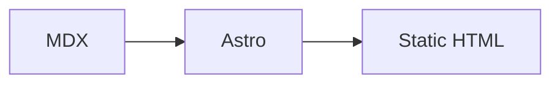

# astro-theme-stellux

`astro-theme-stellux` 是一个基于 Astro 的静态博客主题，用 MDX 管理博客文章、知识库和友链内容。它复刻了 `stellux-web` 的博客列表、文章页、文档页、友链页、Markdown 渲染、深浅色主题、搜索、RSS 和响应式布局，但不依赖后端服务。

## 特性

- Astro 静态输出，适合部署到 Vercel、Netlify、Cloudflare Pages、GitHub Pages 或任意静态服务器。
- 博客文章使用 `src/content/blog` 下的 `.mdx` 文件管理。
- 知识库使用 `src/content/docs` 下的目录结构管理，一级目录就是一个知识库。
- 友链、站点 SEO、导航、头像、分类等信息统一写在 `config.yml`。
- 支持 GitHub Markdown 样式、代码高亮、代码复制、图片预览、KaTeX 数学公式、Mermaid 图表。
- 构建期生成 `/search-index.json`、`/rss.xml` 和 sitemap。
- 主题切换、搜索弹窗、TOC、返回顶部等交互都使用少量浏览器端脚本实现。

## 环境要求

```text
Node.js >= 22.12.0
pnpm
```

安装依赖：

```sh
pnpm install
```

启动开发服务：

```sh
pnpm dev
```

默认访问：

```text
http://127.0.0.1:4321
```

如果端口被占用，Astro 会自动使用新的端口，终端里会显示实际地址。

## 常用命令

| 命令 | 说明 |
| --- | --- |
| `pnpm dev` | 启动本地开发服务 |
| `pnpm check` | 检查 Astro、内容集合和 TypeScript 类型 |
| `pnpm build` | 构建静态站点到 `dist/` |
| `pnpm preview` | 本地预览构建后的静态站点 |
| `pnpm astro` | 运行 Astro CLI |

写完文章、知识库或配置后，建议至少运行：

```sh
pnpm check
pnpm build
```

## 目录结构

```text
astro-theme-stellux/
├── config.yml
├── public/
│   ├── avatar.jpg
│   ├── blog/
│   └── docs/
├── src/
│   ├── components/
│   ├── content/
│   │   ├── blog/
│   │   └── docs/
│   ├── layouts/
│   ├── lib/
│   ├── pages/
│   ├── scripts/
│   └── styles/
└── astro.config.mjs
```

几个最常用的位置：

| 路径 | 用途 |
| --- | --- |
| `config.yml` | 站点标题、URL、SEO、导航、头像、友链分类、友链列表 |
| `src/content/blog/` | 博客文章 |
| `src/content/docs/` | 知识库 |
| `public/blog/` | 博客封面图 |
| `public/docs/` | 知识库封面图 |
| `public/avatar.jpg` | 站点头像 |

## 站点配置

站点个性化配置都放在根目录的 `config.yml`，不要把个人站点信息写死到组件或页面里。

```yaml
stellux:
  title: 浩瀚星河
  url: https://www.golangblog.com
  description: 浩瀚星河的个人技术博客，记录 Golang 学习与开发实践。
  author: 浩瀚星河
  avatar: /avatar.jpg
  repoUrl: https://github.com/codepzj/stellux-web
  locale: zh-CN
  htmlLang: zh-CN
  navLinks:
    - href: /blog
      label: Posts
    - href: /document
      label: Docs
    - href: /friends
      label: Friends
```

字段说明：

| 字段 | 说明 |
| --- | --- |
| `stellux.title` | 站点标题，会用于导航、页脚和 SEO |
| `stellux.url` | 站点正式域名，会用于 sitemap、RSS 和 canonical URL |
| `stellux.description` | 站点描述，会用于 SEO |
| `stellux.author` | 作者名称 |
| `stellux.avatar` | 站点头像路径，默认推荐 `/avatar.jpg` |
| `stellux.repoUrl` | 页脚 GitHub 链接 |
| `stellux.locale` | RSS 等区域配置 |
| `stellux.htmlLang` | HTML `lang` |
| `stellux.navLinks` | 顶部导航和页脚导航 |

站点头像文件放在：

```text
public/avatar.jpg
```

配置里写：

```yaml
stellux:
  avatar: /avatar.jpg
```

## Posts 写文章

博客文章放在：

```text
src/content/blog/
```

每篇文章是一个 `.mdx` 文件。文件名用于源码管理，推荐同时在 frontmatter 里显式写 `slug`，这样以后重命名文件时 URL 不会变化。

新建文章示例：

```text
src/content/blog/my-first-post.mdx
```

访问地址：

```text
/blog/my-first-post
```

推荐模板：

````mdx
---
title: "我的第一篇文章"
description: "这段摘要会显示在博客列表、搜索结果和 SEO 描述里。"
pubDate: 2026-06-26
updatedDate: 2026-06-26
category: "Astro"
tags: ["Astro", "MDX"]
thumbnail: "/blog/my-first-post.jpg"
isTop: false
draft: false
slug: "my-first-post"
---

## 开始

这里写正文。

```ts
export function hello(name: string) {
  return `hello ${name}`
}
```
````

文章字段：

| 字段 | 必填 | 说明 |
| --- | --- | --- |
| `title` | 是 | 文章标题 |
| `description` | 否 | 文章摘要，用于列表、搜索和 SEO |
| `pubDate` | 是 | 发布时间 |
| `updatedDate` | 否 | 更新时间 |
| `category` | 否 | 分类名称 |
| `tags` | 否 | 标签列表 |
| `thumbnail` | 否 | 文章封面路径 |
| `isTop` | 否 | 是否置顶 |
| `draft` | 否 | 是否草稿 |
| `slug` | 否 | 文章 URL 别名 |

排序规则：

1. `isTop: true` 的文章排在最前面。
2. 同为置顶或同为普通文章时，按 `pubDate` 从新到旧排序。
3. 生产构建中会隐藏 `draft: true` 的文章。

文章封面统一放在：

```text
public/blog/
```

命名建议：

```text
public/blog/{slug}.jpg
```

frontmatter 写：

```yaml
thumbnail: "/blog/my-first-post.jpg"
```

## Docs 写知识库

知识库用于组织多篇有关联的文档。它和博客文章不同：

- 博客按时间线展示。
- 知识库按目录结构展示。
- `src/content/docs` 下的一级目录就是一个知识库。
- 每个知识库根目录只需要保留一个 `index.mdx`。
- 子文件夹不需要 `index.mdx`，文件夹节点由代码根据目录路径自动生成。

访问入口：

```text
/document
```

知识库根地址：

```text
/document/{rootAlias}
```

知识库页面地址：

```text
/document/{rootAlias}/{pagePath}
```

示例结构：

```text
src/content/docs/my-guide/
├── index.mdx
├── install.mdx
└── basics/
    └── first-page.mdx
```

对应地址：

| 文件 | 地址 |
| --- | --- |
| `src/content/docs/my-guide/index.mdx` | `/document/my-guide` |
| `src/content/docs/my-guide/install.mdx` | `/document/my-guide/install` |
| `src/content/docs/my-guide/basics/first-page.mdx` | `/document/my-guide/basics/first-page` |

知识库根文件模板：

````mdx
---
title: "我的知识库"
description: "这个知识库的简介，会显示在文档列表里。"
pubDate: 2026-06-26
updatedDate: 2026-06-26
sort: 10
thumbnail: "/docs/my-guide.jpg"
---
````

知识库页面模板：

````mdx
---
title: "安装"
description: "安装说明。"
pubDate: 2026-06-26
updatedDate: 2026-06-26
sort: 1
---

## 安装

这里写安装步骤。
````

知识库字段：

| 字段 | 必填 | 说明 |
| --- | --- | --- |
| `title` | 是 | 知识库名称或页面标题 |
| `description` | 否 | 知识库简介或页面摘要 |
| `pubDate` | 否 | 创建时间 |
| `updatedDate` | 否 | 更新时间 |
| `thumbnail` | 否 | 知识库封面 |
| `sort` | 否 | 排序，数字越小越靠前 |

不用手写这些字段：

```text
rootId
kind
contentId
parentId
documentId
isDir
```

这些信息会由路径自动推导。

知识库封面统一放在：

```text
public/docs/
```

命名建议：

```text
public/docs/{rootAlias}.jpg
```

frontmatter 写：

```yaml
thumbnail: "/docs/my-guide.jpg"
```

## Friends 新增友链

友链不再写单独的 JSON 文件，统一放在 `config.yml`。

相关配置有三块：

| 配置 | 说明 |
| --- | --- |
| `friendTypes` | 友链分类 |
| `friendsPage` | 友链页标题、描述、空状态和交换规则文案 |
| `friends` | 友链列表 |

新增友链：

```yaml
friends:
  - name: "朋友站点"
    description: "这里写站点简介。"
    site_url: "https://example.com"
    avatar_url: "https://example.com/avatar.png"
    website_type: 1
```

友链字段：

| 字段 | 必填 | 说明 |
| --- | --- | --- |
| `name` | 是 | 站点名称 |
| `description` | 否 | 站点简介 |
| `site_url` | 是 | 站点链接 |
| `avatar_url` | 否 | 头像或 logo 地址 |
| `website_type` | 否 | 友链分类编号 |

当前分类：

| `website_type` | 分类 |
| --- | --- |
| `0` | 大佬 |
| `1` | 技术型 |
| `2` | 生活型 |

分类由 `config.yml` 的 `friendTypes` 决定。想改分类名称、说明或新增分类，改这里即可：

```yaml
friendTypes:
  - value: 0
    label: 大佬
    description: 长期输出与值得反复阅读的站点
  - value: 1
    label: 技术型
    description: 工程、架构与技术实践相关的朋友
  - value: 2
    label: 生活型
    description: 记录日常、观点与个人表达的角落
```

友链页文案在 `friendsPage`：

```yaml
friendsPage:
  title: 友链
  eyebrow: Friends
  description: 一些认真写作、持续创造，或者单纯让人想常去看看的站点。
  emptyTitle: 暂时还没有友链
  emptyDescription: 欢迎把你的站点投递过来，审核后会展示在这里。
  exchangeTitle: 友链交换规则
  exchangeDescription: 每月持续输出内容；请先挂载本站友链，完成后提交申请。
```

## MDX 写法

博客文章和知识库页面都使用 MDX。正文建议从 `##` 开始，因为页面标题已经由 frontmatter 的 `title` 渲染。

### 标题和目录

```mdx
## 第一节

### 一个小节
```

文章页和文档详情页会根据标题生成目录。

### 代码块

````mdx
```go
package main

func main() {
  println("hello stellux")
}
```
````

代码块会自动高亮，并带复制按钮。

### 表格

```mdx
| 名称 | 说明 |
| --- | --- |
| Astro | 静态站点框架 |
| MDX | Markdown + JSX |
```

### 数学公式

行内公式：

```mdx
$E = mc^2$
```

块级公式：

```mdx
$$
\int_0^1 x^2 dx = \frac{1}{3}
$$
```

### Mermaid

````mdx

````

### 图片

```mdx

```

图片可以使用远程地址，也可以放到 `public` 目录。正文图片支持点击预览。

## 搜索、RSS 和 sitemap

构建时会自动生成：

| 地址 | 说明 |
| --- | --- |
| `/search-index.json` | 本地搜索索引 |
| `/rss.xml` | RSS 订阅 |
| `/sitemap-index.xml` | sitemap 索引 |

新增或修改文章、知识库、友链、站点配置后，重新构建即可更新静态产物：

```sh
pnpm build
```

## 部署

先构建：

```sh
pnpm build
```

构建结果在：

```text
dist/
```

把 `dist/` 部署到任意静态托管服务即可。

部署前确认 `config.yml` 中的正式域名正确：

```yaml
stellux:
  url: https://www.golangblog.com
```

如果站点部署在子路径，需要同时检查 Astro 的 `base` 配置和所有静态资源路径。本项目默认按根路径部署。

## 常见问题

### 博客文章没有出现

检查：

- 文件是否放在 `src/content/blog/`。
- frontmatter 是否有必填的 `title` 和 `pubDate`。
- 生产环境里是否设置了 `draft: true`。
- 是否运行过 `pnpm check` 查看内容集合报错。

### 文章 URL 不符合预期

推荐每篇文章都写：

```yaml
slug: "my-post"
```

访问地址就是：

```text
/blog/my-post
```

### 知识库列表没有出现

检查是否存在：

```text
src/content/docs/{rootAlias}/index.mdx
```

`src/content/docs` 下的一级目录才会被识别为知识库。

### 知识库子页面 404

检查文件路径和访问路径是否一致。例如：

```text
src/content/docs/my-guide/basics/install.mdx
```

对应：

```text
/document/my-guide/basics/install
```

### 侧边栏文件夹显示不对

文件夹标题来自真实目录名。想改侧边栏文件夹名称，直接改目录名。

子文件夹不需要 `index.mdx`。

### 封面图不显示

博客封面建议：

```text
public/blog/{slug}.jpg
```

知识库封面建议：

```text
public/docs/{rootAlias}.jpg
```

frontmatter 路径要从站点根开始写：

```yaml
thumbnail: "/blog/my-post.jpg"
```

或：

```yaml
thumbnail: "/docs/my-guide.jpg"
```

### 友链分类不对

检查友链的 `website_type` 是否能在 `friendTypes` 里找到对应 `value`。

### 搜索或 RSS 没更新

重新构建：

```sh
pnpm build
```

然后检查：

```text
/search-index.json
/rss.xml
```

## 内置使用文档

站内也有一份知识库版使用文档：

```text
/document/astro-stellux-theme
```

它把主题使用拆成了：

- `Posts 写文章`
- `Docs 写知识库`
- `Friends 新增友链`

README 适合从仓库首页快速了解主题；站内知识库适合发布后给站点维护者长期查看。
