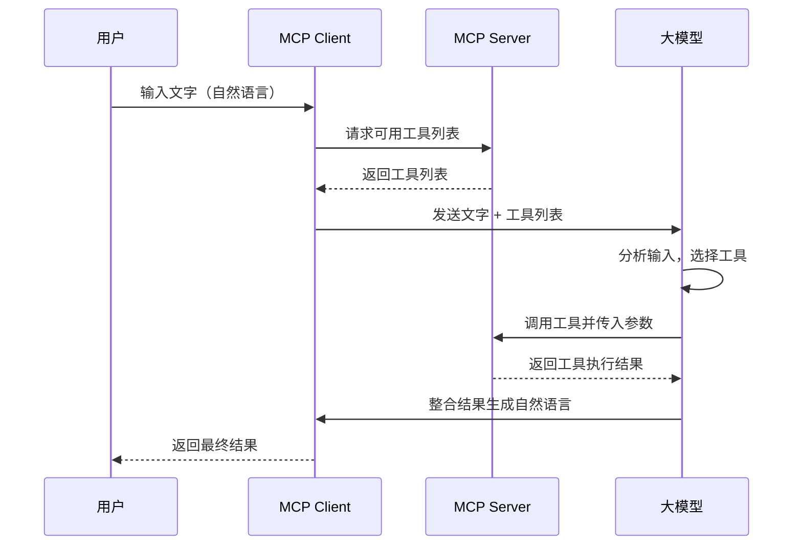

随着ai的快速发展，mcp server也逐渐被大家所熟知，但是我只是大概知道有这么个东西，经常在一些文档、组件库当中看到其接入方式，但是具体怎么使用，还是一头雾水

于是，这周末我花了一点时间研究了一下mcp server

## 什么是mcp协议

mcp协议是model context protocol的缩写，是一种用于与ai模型交互的协议。

> mcp协议的目的是：提供一个标准化的接口，实现标准输入【自然语言】与大模型之间的交互

## mcp server的原理

mcp server的原理是：

1. 人通过mcp client输入文字
2. 向mcp server获取list of tools
3. mcp client将文字和list of tools发送给大模型
4. 大模型根据文字和list of tools选择一个最合适工具
5. 提供参数，调用mcp server的tool，获取结果
6. mcp server将输出结果返回给大模型
7. 大模型对信息进行总结，并返回给用户

对应有两个作用：
1. 接受mcp client调用，返回list of tools
2. 接受大模型调用，选择最合适的tool，大模型提供参数，mcp server调用tool，返回结果给大模型


具体流程图如下：


## mcp server的实现

mcp server的实现方式有多种，官方也提供了多种语言的sdk

> 官方Github仓库地址：https://github.com/orgs/modelcontextprotocol/repositories


## python实现一个简单的mcp server

### 1. 下载uv

官方文档：https://docs.astral.sh/uv/

安装命令
```bash
curl -LsSf https://astral.sh/uv/install.sh | sh
```

### 2. 创建项目

```bash
uv new mcp-server-demo
```

### 3. 安装mcp server依赖

```bash
uv add "mcp[cli]"
```

### 4. 新建main.py

```python
from mcp.server.fastmcp import FastMCP

mcp = FastMCP("Demo")


@mcp.tool()
def add(a: int, b: int) -> int:
    # 这个注释是必须要写的
    """Add two numbers"""
    return a + b


@mcp.resource("greeting://{name}")
def get_greeting(name: str) -> str:
    """Get a Peosonize Greeting"""
    return f"Hello, {name}"


if __name__ == "__main__":
    print()
    mcp.run(transport="stdio")
```

函数下方的多行注释是必须要写的，这是mcp server的规范，用于描述工具的用途和参数。

### 5. 运行mcp server

```bash
uv run mcp-server-demo
```

### 6. 在cherry studio中接入mcp server

> cherry studio官方地址：https://www.cherry-ai.com/

用这个ai客户端的原因是：
1. 国内服务器，速度快
2. 免费使用Qwen3-8B和GLM4.5大模型


在cherry studio中接入mcp server：


保存后启动，如果开关能正常启用，则说明mcp server接入成功


### 7. 使用

选择“加法”这个tool


然后提问


**非常🐮🍺，真的实现了！**

## ai编程软件接入mcp server

cursor，codex，claude code，trae等其实都是mcp client，他们也可以接入许多mcp server去实现更加复杂的功能，提升开发效率

举个cursor的例子

新建`.cursor/mcp.json`

```json
{
  "mcpServers": {
    "mysql": {
      "command": "uv",
      "args": [
        "--directory",
        "/Users/pzj/Code/mcp/mysql_mcp_server",
        "run",
        "mysql_mcp_server"
      ],
      "env": {
        "MYSQL_HOST": "xx.xx.xx.xx",
        "MYSQL_PORT": "3306",
        "MYSQL_USER": "xx",
        "MYSQL_PASSWORD": "xx",
        "MYSQL_DATABASE": "xx"
      }
    },
    "Ant Design Components": {
      "command": "npx",
      "args": [
        "@jzone-mcp/antd-components-mcp"
      ]
    },
    "next-devtools": {
      "command": "npx",
      "args": ["-y", "next-devtools-mcp@latest"]
    },
    "tailwindcss-server": {
      "command": "npx",
      "args": ["-y", "tailwindcss-mcp-server"]
    },
    "note-server - API 文档": {
      "command": "npx",
      "args": [
        "-y",
        "apifox-mcp-server@latest",
        "--project-id=xx"
      ],
      "env": {
        "APIFOX_ACCESS_TOKEN": "xx"
      }
    }
  }
}
```

可以看到，我在cursor中接入了mysql，ant design，next，tailwindcss，apifox等mcp server，这样我就可以在cursor中使用这些工具来辅助我编程，大大提升开发效率


但是，我发现市面上的mcp server大多数都是一些小工具以及组件库的mcp server

对于一些后端的服务如mysql，redis，mongodb，elasticsearch，kafka，rabbitmq等，市面上的mcp server可能有，但是仅仅只是执行命令而已，而且数据非常敏感并且交给ai操作安全性特别低


**ai竟然真能删库跑路**


**所以我们在使用ai写代码的时候，一定要进行code review，不要把ai写的代码直接提交到仓库，代码是ai写的，锅不能甩给ai，风险是自己的🤡**
