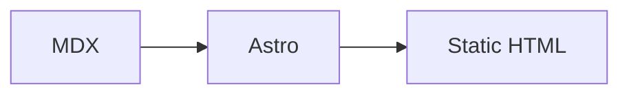

## 文章放在哪里

博客文章放在：

```text
src/content/blog/
```

每篇文章是一个 `.mdx` 文件。文件名用于管理源码，真正的线上 URL 推荐用 frontmatter 里的 `slug` 固定下来。

示例：

```text
src/content/blog/my-first-post.mdx
```

访问地址：

```text
/blog/my-first-post
```

## 新建一篇文章

推荐从这个模板开始：

````mdx
---
title: "我的第一篇文章"
description: "这段摘要会显示在博客列表、搜索结果和 SEO 描述里。"
pubDate: 2026-06-26
updatedDate: 2026-06-26
category: "Astro"
tags: ["Astro", "MDX"]
thumbnail: "/blog/my-first-post.jpg"
isTop: false
draft: false
slug: "my-first-post"
---

## 开始

这里写正文。

```ts
export function hello(name: string) {
  return `hello ${name}`
}
```
````

保存后启动开发服务器：

```sh
pnpm dev
```

打开：

```text
http://127.0.0.1:4322/blog/my-first-post
```

## Frontmatter 字段

| 字段 | 必填 | 类型 | 说明 |
| --- | --- | --- | --- |
| `title` | 是 | string | 文章标题 |
| `description` | 否 | string | 文章摘要，用于列表、搜索和 SEO |
| `pubDate` | 是 | date | 发布时间 |
| `updatedDate` | 否 | date | 更新时间 |
| `category` | 否 | string | 分类名称 |
| `tags` | 否 | string[] | 标签列表 |
| `thumbnail` | 否 | string | 文章封面路径 |
| `isTop` | 否 | boolean | 是否置顶 |
| `draft` | 否 | boolean | 是否草稿 |
| `slug` | 否 | string | 文章 URL 别名 |

推荐每篇文章都显式写 `slug`。这样以后重命名文件时，文章 URL 不会跟着变化。

## 文章封面

文章封面统一放在：

```text
public/blog/
```

命名规则：

```text
public/blog/{slug}.jpg
```

frontmatter 写：

```yaml
thumbnail: "/blog/my-first-post.jpg"
```

构建后它会作为静态资源直接访问：

```text
/blog/my-first-post.jpg
```

## 正文写法

正文使用 MDX，可以写普通 Markdown，也可以使用表格、代码块、数学公式和 Mermaid。

### 标题和目录

文章详情页会自动读取二级、三级标题生成浮动目录。正文建议从 `##` 开始：

```mdx
## 第一节

### 一个小节
```

### 代码块

代码块会自动高亮，并生成复制按钮：

````mdx
```go
package main

func main() {
	println("hello stellux")
}
```
````

### 表格

```mdx
| 名称 | 说明 |
| --- | --- |
| Astro | 静态站点框架 |
| MDX | Markdown + JSX |
```

### 数学公式

行内公式：

```mdx
$E = mc^2$
```

块级公式：

```mdx
$$
\int_0^1 x^2 dx = \frac{1}{3}
$$
```

### Mermaid

````mdx

````

### 图片

正文图片可以使用远程地址，也可以放到 `public`：

```mdx

```

正文图片支持点击预览。

## 草稿和发布

开发环境会显示草稿，生产构建会隐藏草稿。

```yaml
draft: true
```

正式发布前改成：

```yaml
draft: false
```

## 排序规则

博客列表排序逻辑：

1. `isTop: true` 的文章在最前面。
2. 同为置顶或同为普通文章时，按 `pubDate` 从新到旧排序。
3. 生产构建中隐藏 `draft: true`。

## 搜索和 RSS

构建时会生成搜索索引：

```text
/search-index.json
```

RSS 地址：

```text
/rss.xml
```

新增或修改文章后，重新构建即可更新搜索和 RSS：

```sh
pnpm build
```

## 写完后的检查

建议每次写完文章后跑：

```sh
pnpm check
pnpm build
```

如果只是快速预览：

```sh
pnpm dev
```
